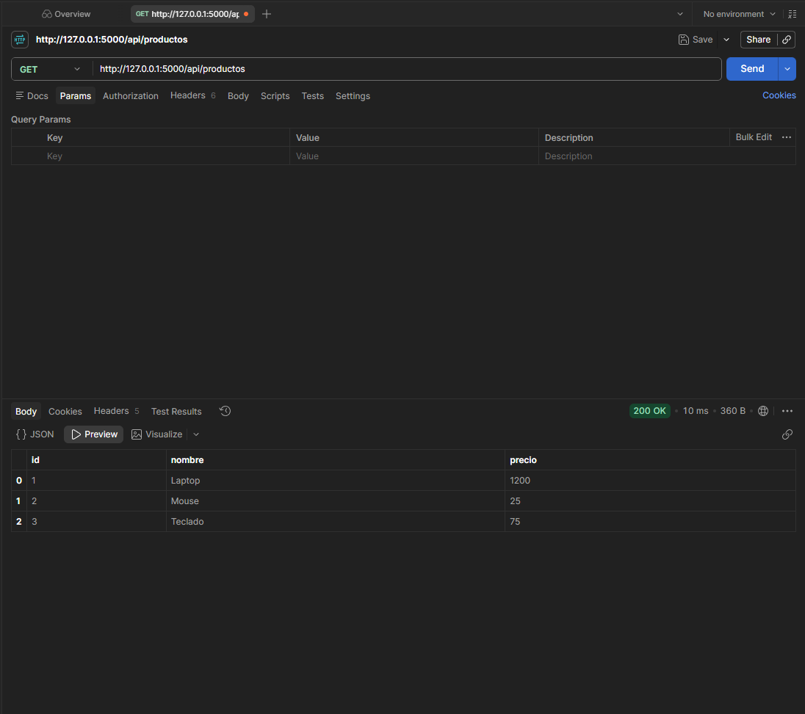
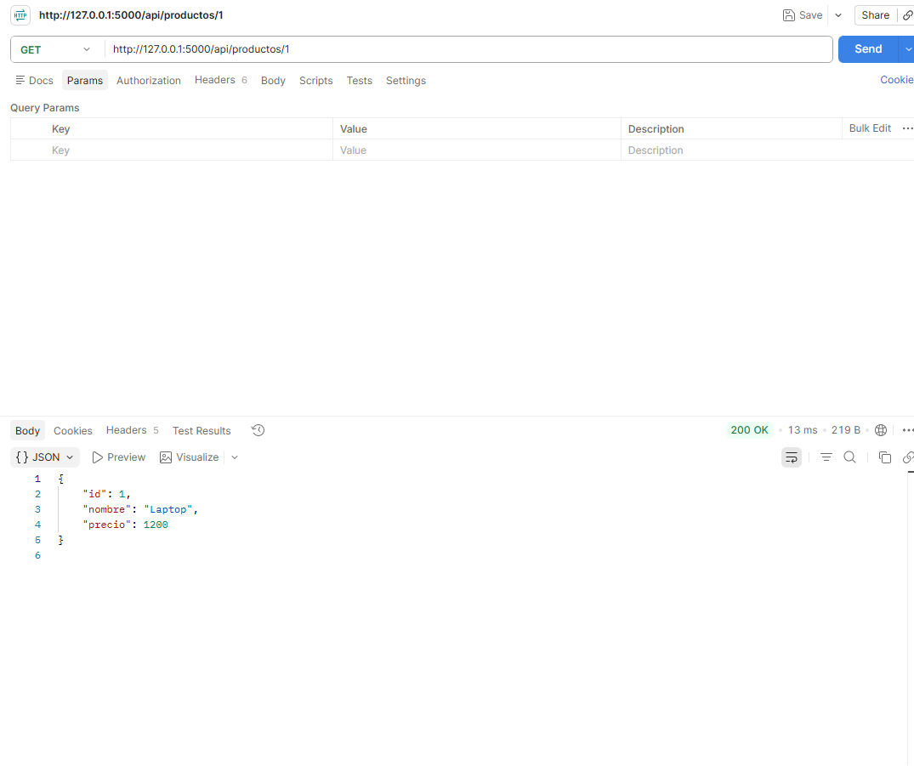
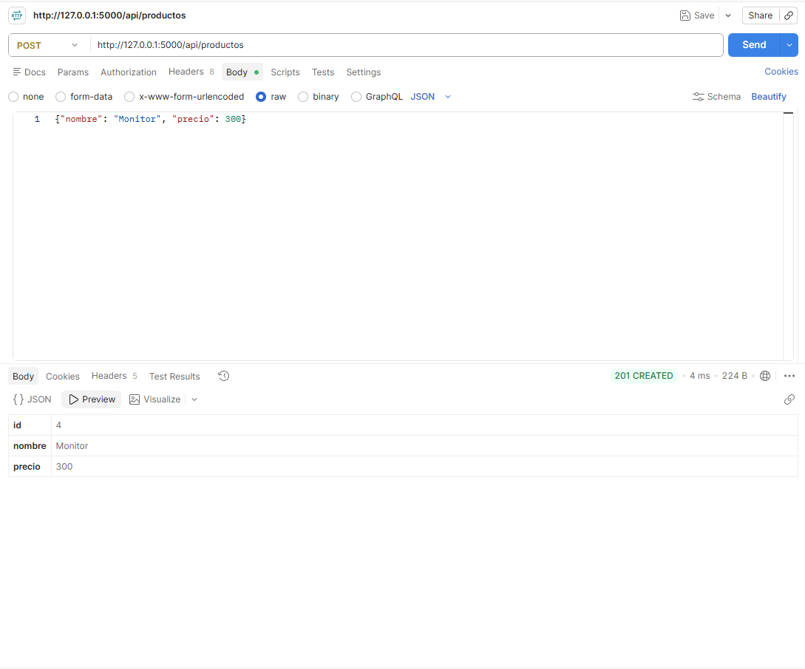
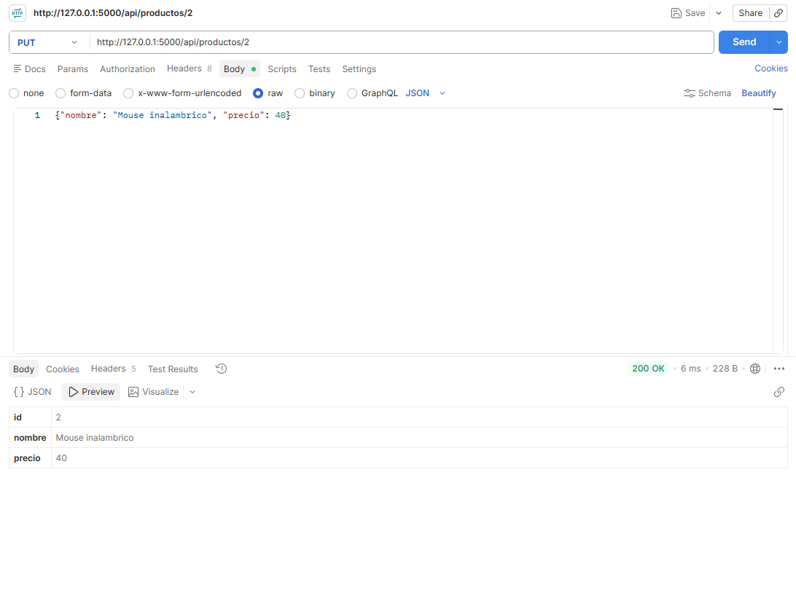
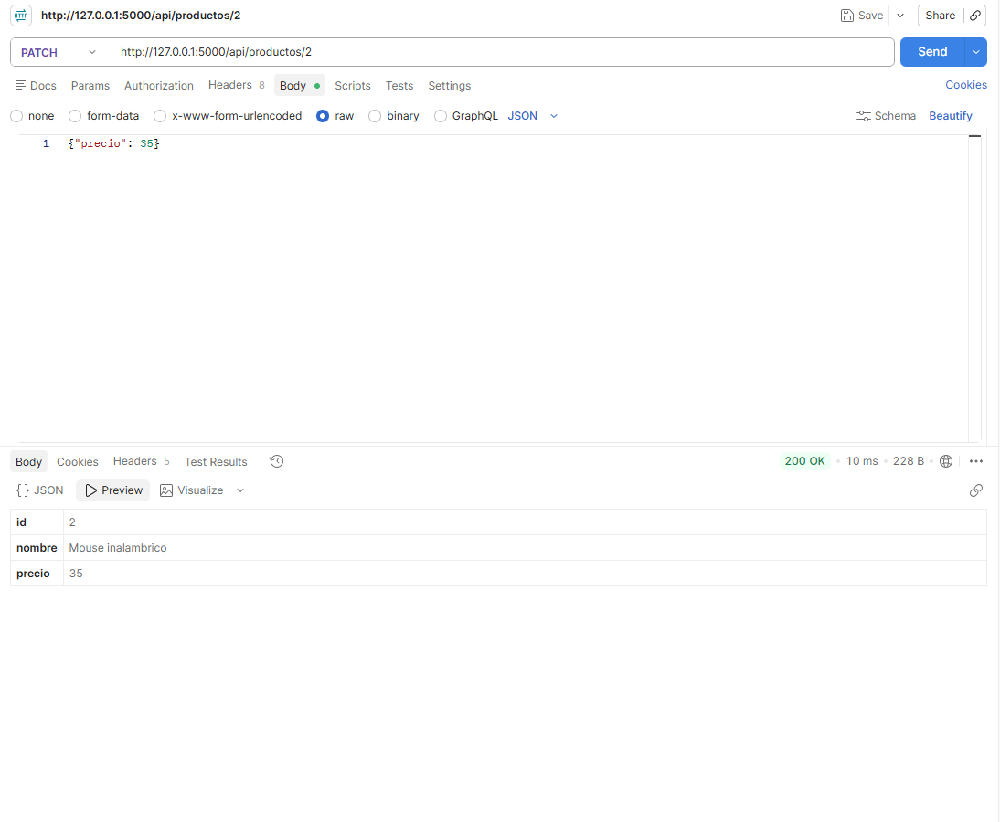
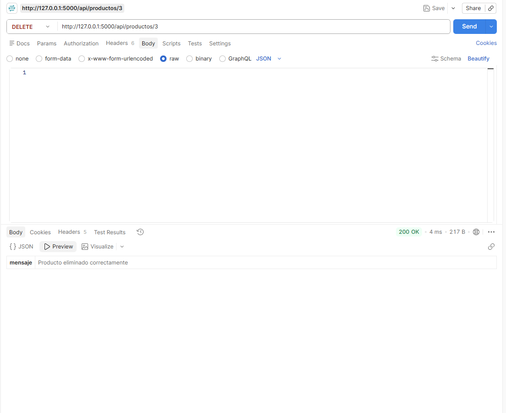

# API de Productos con Flask (GET, POST, PUT, PATCH, DELETE)

API REST desarrollada en Python con Flask para gestionar una lista de productos guardada en memoria. Permite consultar, crear, actualizar (completa y parcialmente) y eliminar productos. Fue probada usando Postman.

## Contenido del repositorio

- `api_productos.py`: código fuente completo de la API.
- `README.md`: este instructivo.
- `.gitignore`: le indica a Git qué archivos/carpetas no debe subir (como el entorno virtual).
- `capturas/`: carpeta con las capturas de pantalla de cada prueba en Postman.

## Requisitos previos

Antes de empezar, asegúrate de tener instalado:

1. **Python 3.10 o superior.** Descárgalo desde [python.org/downloads](https://www.python.org/downloads/). Al instalarlo en Windows, marca la casilla **"Add Python to PATH"** antes de darle a "Install Now".
2. **Postman** (versión de escritorio, no la web). Descárgalo desde [postman.com/downloads](https://www.postman.com/downloads/).
3. **Git** (opcional, solo si vas a clonar el repositorio en lugar de descargarlo como ZIP). Descárgalo desde [git-scm.com/downloads](https://git-scm.com/downloads).

Para confirmar que Python quedó bien instalado, abre una terminal (PowerShell o CMD en Windows) y ejecuta:

```bash
python --version
```

Debe mostrarte algo como `Python 3.12.x`. Si te da un error de "no se reconoce el comando", reinicia tu computador e intenta de nuevo.

## Instalación y ejecución paso a paso

### Paso 1: Obtener el código

**Opción A — Clonando con Git:**

```bash
git clone https://github.com/Alejandro-LP/api-productos-flask.git
cd api-productos-flask
```

**Opción B — Descargando el ZIP:**

Entra a [github.com/Alejandro-LP/api-productos-flask](https://github.com/Alejandro-LP/api-productos-flask), haz clic en el botón verde **"Code"** → **"Download ZIP"**, extrae el archivo en una carpeta de tu preferencia, y abre una terminal dentro de esa carpeta.

### Paso 2: Crear un entorno virtual (recomendado)

Un entorno virtual evita que las librerías de este proyecto se mezclen con otras que tengas instaladas en tu computador.

```bash
python -m venv venv
```

Esto crea una carpeta llamada `venv` dentro de tu proyecto.

### Paso 3: Activar el entorno virtual

- **En Windows (PowerShell):**
  ```bash
  .\venv\Scripts\Activate
  ```
  Si te aparece un error de permisos como *"no se puede cargar porque la ejecución de scripts está deshabilitada"*, ejecuta primero:
  ```bash
  Set-ExecutionPolicy -Scope Process -ExecutionPolicy Bypass
  ```
  y vuelve a intentar activar.

- **En Mac/Linux:**
  ```bash
  source venv/bin/activate
  ```

Sabrás que el entorno quedó activado porque tu terminal mostrará `(venv)` al inicio de la línea, por ejemplo:
```
(venv) PS C:\Users\usuario\api-productos-flask>
```

### Paso 4: Instalar Flask

Con el entorno virtual **activado**, ejecuta:

```bash
pip install flask
```

Espera a que termine de instalar (verás un mensaje `Successfully installed flask...`).

### Paso 5: Ejecutar el servidor

```bash
python api_productos.py
```

Si todo sale bien, la terminal se quedará quieta mostrando algo como:

```
 * Serving Flask app 'api_productos'
 * Debug mode: on
 * Running on http://127.0.0.1:5000
Press CTRL+C to quit
```

**Importante:** deja esta terminal abierta y el servidor corriendo mientras haces las pruebas en Postman. Si cierras la terminal, el servidor se detiene y Postman no podrá conectarse.

Para detener el servidor en cualquier momento, presiona `Ctrl + C` en esa terminal.

## Endpoints disponibles

| Método | Ruta                   | Descripción                     |
|--------|------------------------|----------------------------------|
| GET    | `/`                    | Mensaje de bienvenida            |
| GET    | `/api/productos`       | Obtener todos los productos      |
| GET    | `/api/productos/<id>`  | Obtener un producto por su id    |
| POST   | `/api/productos`       | Crear un nuevo producto          |
| PUT    | `/api/productos/<id>`  | Actualizar un producto completo  |
| PATCH  | `/api/productos/<id>`  | Actualizar solo algunos campos   |
| DELETE | `/api/productos/<id>`  | Eliminar un producto             |

Los productos iniciales, ya cargados en el servidor al arrancar, son:

```json
[
  {"id": 1, "nombre": "Laptop", "precio": 1200},
  {"id": 2, "nombre": "Mouse", "precio": 25},
  {"id": 3, "nombre": "Teclado", "precio": 75}
]
```

## Cómo probar cada método desde Postman (paso a paso)

Antes de empezar: abre Postman Desktop, y confirma que el servidor Flask (Paso 5 de arriba) esté corriendo y sin errores en la terminal.

### 1. GET - Obtener todos los productos

1. Haz clic en el botón **"+"** (o **"New" → "HTTP Request"**) para crear una nueva pestaña de petición.
2. En el menú desplegable de la izquierda (donde dice `GET` por defecto), déjalo en **GET**.
3. En el campo de la URL, escribe exactamente: `http://127.0.0.1:5000/api/productos`
4. Haz clic en el botón azul **"Send"**.
5. **Resultado esperado:** en la parte de abajo verás el código `200 OK` en verde, y un JSON con los 3 productos.

**Pantallazo:**



### 2. GET - Obtener un producto por id

1. Cambia la URL a: `http://127.0.0.1:5000/api/productos/1`
2. El método sigue siendo **GET**.
3. Haz clic en **"Send"**.
4. **Resultado esperado:** código `200 OK` con solo el producto "Laptop" (id 1). Si usas un id que no existe (por ejemplo `/api/productos/999`), obtendrás `404` con el mensaje `"Producto no encontrado"`.

**Pantallazo:**



### 3. POST - Crear un producto nuevo

1. En el menú desplegable de la izquierda, cambia el método a **POST**.
2. URL: `http://127.0.0.1:5000/api/productos`
3. Debajo de la URL, haz clic en la pestaña **"Body"**.
4. Selecciona la opción **"raw"**.
5. A la derecha de "raw" aparece un menú desplegable que probablemente diga "Text"; cámbialo a **"JSON"**.
6. En el cuadro de texto grande que aparece, escribe exactamente (con las llaves incluidas):
   ```json
   {
     "nombre": "Monitor",
     "precio": 300
   }
   ```
7. Haz clic en **"Send"**.
8. **Resultado esperado:** código `201 Created` con el producto recién creado, incluyendo un `id` nuevo asignado automáticamente (probablemente el 4).

**Pantallazo:**



### 4. PUT - Actualizar un producto completo

1. Cambia el método a **PUT**.
2. URL: `http://127.0.0.1:5000/api/productos/2` (usa un id que exista).
3. Pestaña **"Body"** → **"raw"** → **"JSON"** (igual que en el POST).
4. Escribe:
   ```json
   {
     "nombre": "Mouse inalámbrico",
     "precio": 40
   }
   ```
5. Haz clic en **"Send"**.
6. **Resultado esperado:** código `200 OK` con el producto actualizado. El `id` no cambia, pero `nombre` y `precio` sí se reemplazan por los nuevos valores.

**Pantallazo:**



### 5. PATCH - Actualizar parcialmente un producto

1. Cambia el método a **PATCH**.
2. Usa la misma URL del paso anterior: `http://127.0.0.1:5000/api/productos/2`
3. Pestaña **"Body"** → **"raw"** → **"JSON"**.
4. Escribe solo el campo que quieres cambiar:
   ```json
   {
     "precio": 35
   }
   ```
5. Haz clic en **"Send"**.
6. **Resultado esperado:** código `200 OK`. Solo el campo `precio` cambia a 35; el `nombre` ("Mouse inalámbrico") se mantiene igual porque no lo enviaste.

**Pantallazo:**



### 6. DELETE - Eliminar un producto

1. Cambia el método a **DELETE**.
2. URL: `http://127.0.0.1:5000/api/productos/3`
3. No necesitas configurar nada en la pestaña "Body".
4. Haz clic en **"Send"**.
5. **Resultado esperado:** código `200 OK` con el mensaje `"Producto eliminado correctamente"`.
6. **Verificación opcional:** cambia el método de nuevo a GET con esa misma URL y dale Send; ahora debería darte `404 Producto no encontrado`, confirmando que sí se eliminó.

**Pantallazo:**



## Validaciones implementadas

- Toda petición `POST`, `PUT` y `PATCH` debe enviarse en formato JSON; de lo contrario responde `400` con el error `"Solicitud debe ser JSON"`.
- En `POST` y `PUT`, los campos `nombre` y `precio` son obligatorios. Si falta alguno, responde `400`.
- El campo `precio` debe ser un número mayor o igual a 0. Si envías texto, o un número negativo, responde `400`.
- El campo `id` nunca puede ser modificado por el cliente, incluso si se envía en el body de `PUT` o `PATCH`.
- Si el producto solicitado no existe, cualquier operación (`GET`, `PUT`, `PATCH`, `DELETE`) responde `404` con el mensaje `"Producto no encontrado"`.

## Solución de problemas comunes

| Problema | Causa probable | Solución |
|---|---|---|
| `ModuleNotFoundError: No module named 'flask'` | Flask no está instalado en el entorno/Python que estás usando para correr el script. | Activa tu entorno virtual y ejecuta `pip install flask` de nuevo. |
| Postman no se conecta / "Could not send request" | El servidor Flask no está corriendo, o se detuvo. | Revisa la terminal donde ejecutaste `python api_productos.py`; debe seguir mostrando `Running on http://127.0.0.1:5000` sin errores. |
| La terminal muestra un bucle infinito de `"Detected change in..."` | El modo `debug=True` está vigilando demasiados archivos (común si usas un entorno con muchas librerías, como Anaconda base). | Cambia la última línea del código a `app.run(debug=True, port=5000, use_reloader=False)`. |
| `404 Producto no encontrado` en un id que debería existir | Ese id ya fue eliminado antes, o nunca existió (los ids nuevos se generan de forma incremental). | Haz un `GET /api/productos` primero para confirmar qué ids existen actualmente. |
| Postman Web no se conecta a `127.0.0.1` | Postman Web corre en el navegador y no puede acceder directamente a tu máquina local. | Usa Postman Desktop, o instala el "Postman Agent" desde Postman Web. |

## Notas

- Los datos se almacenan en memoria (una lista de Python), por lo que se reinician cada vez que se detiene y se vuelve a ejecutar el servidor.
- Este proyecto es con fines educativos; no está pensado para producción (no tiene base de datos ni autenticación).

## Autor

- Nombre: Alejandro
- Curso: Backend
- Repositorio: [github.com/Alejandro-LP/api-productos-flask](https://github.com/Alejandro-LP/api-productos-flask)
